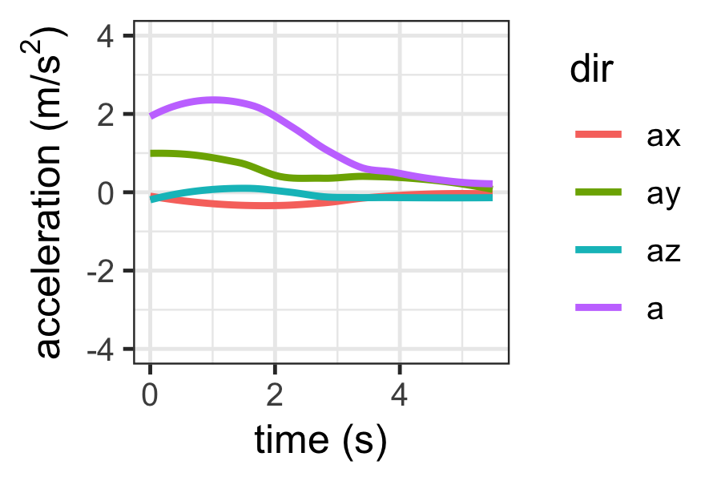
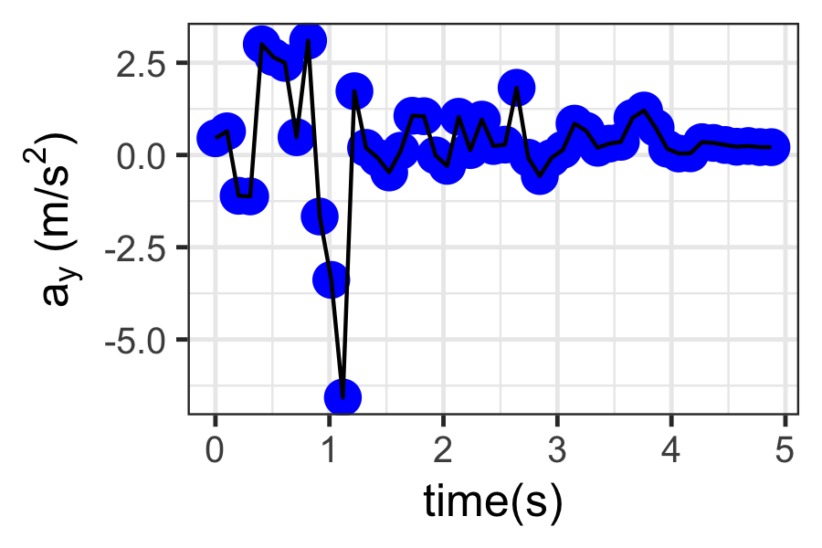
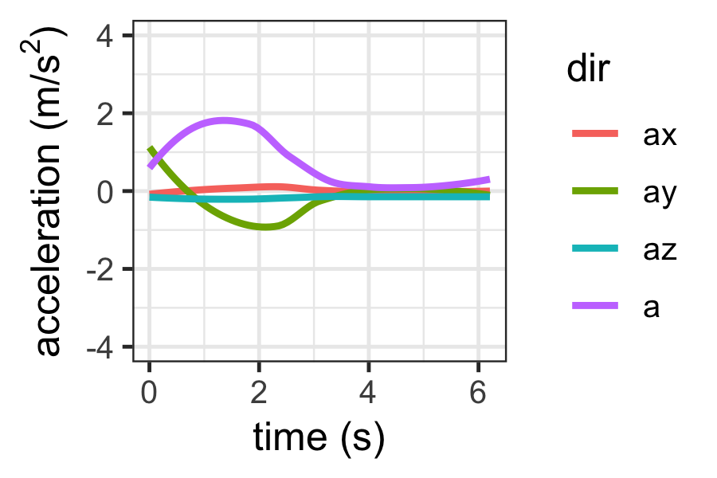
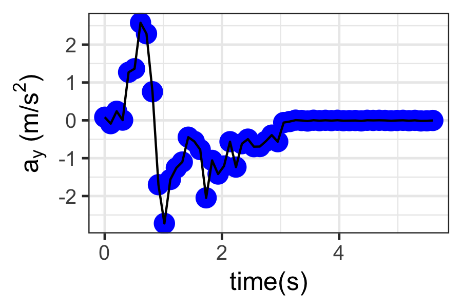
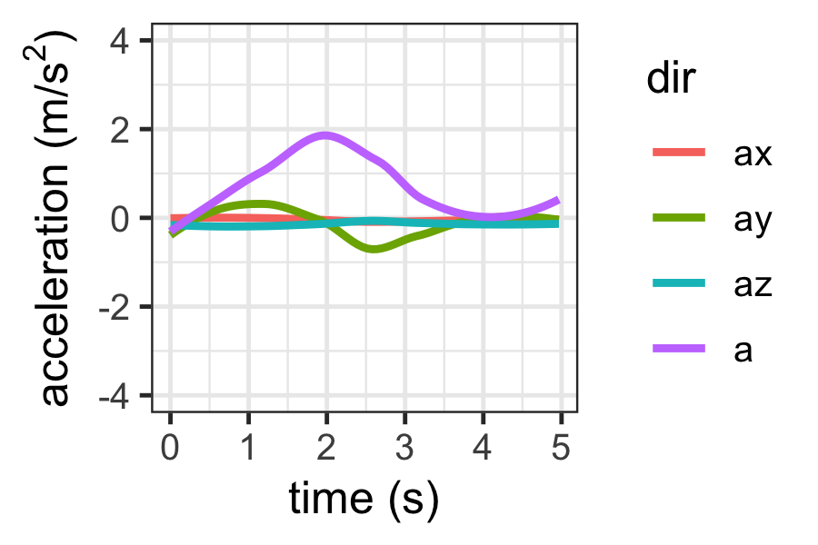
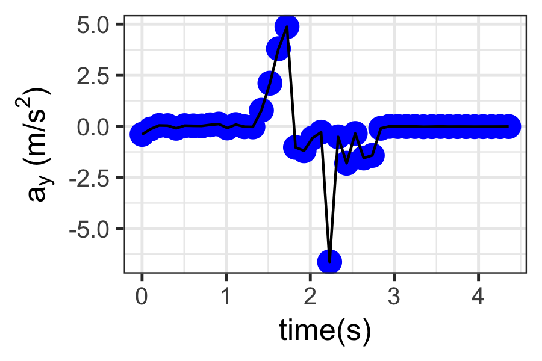

# phyphox-ForceN-Motion

Using the (PhyPhox app)[https://phyphox.org/], the following data sets were recorded and then graphed.

## Cart Building

The cart was built from a rectangular piece of carton, a skewer, a drinking straw, tape and bottle caps. 

## Cart Down Hill

The cart is rolling down a slightly inclined plane before hitting the floor.

Here is the y-component

## Push and Friction

Push the cart and let it slow down

Here is the y-component

## Cart has Collision

Cart is pushed, then let slow down for a short while, before it collides with object

Here is the y-component (direction of motion of cart):
